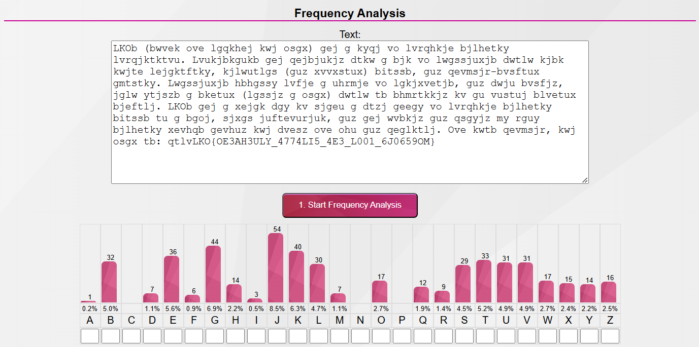
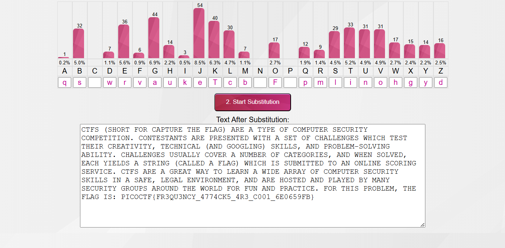
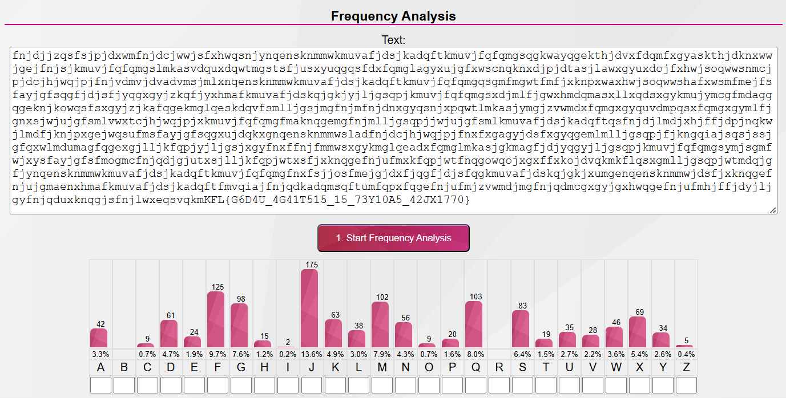
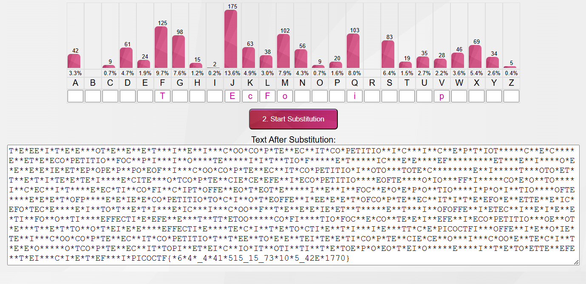
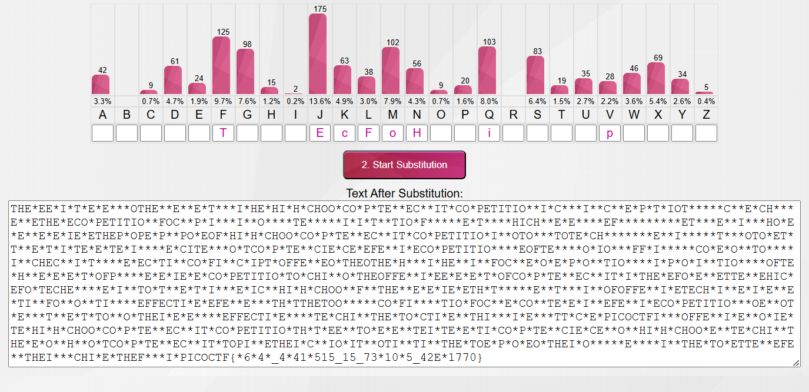
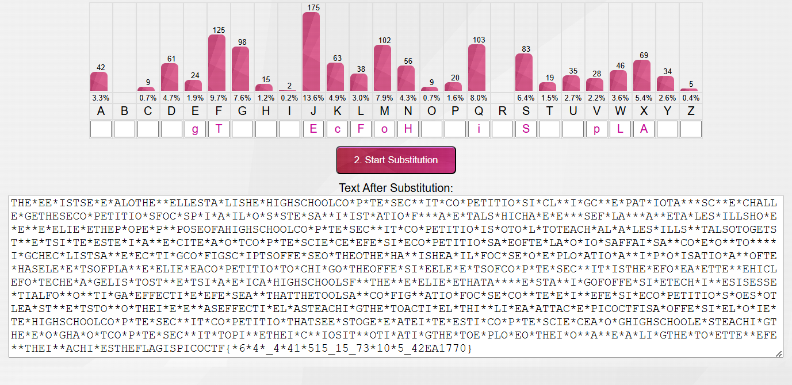
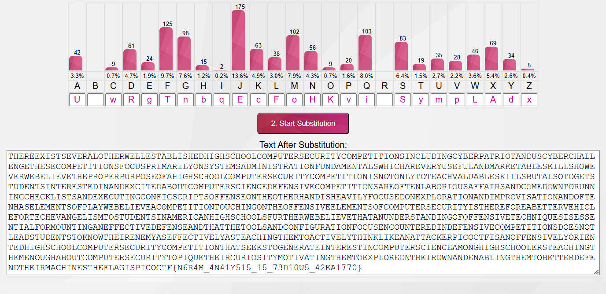

# Cryptography

## substitution0

### Challenge
A message has come in but it seems to be all scrambled. Luckily it seems to have the key at the beginning. Can you crack this substitution cipher?  
Download the message [here](https://artifacts.picoctf.net/c/154/message.txt).

### Solving
The **txt** file given contains:
```
ZGSOCXPQUYHMILERVTBWNAFJDK 

Qctcnrel Mcptzlo ztebc, fuwq z ptzac zlo bwzwcmd zut, zlo gtenpqw ic wqc gccwmc
xtei z pmzbb szbc ul fqusq uw fzb clsmebco. Uw fzb z gcznwuxnm bsztzgzcnb, zlo, zw
wqzw wuic, nlhlefl we lzwntzmubwb—ex sentbc z ptczw rtukc ul z bsuclwuxus reulw
ex aucf. Wqctc fctc wfe tenlo gmzsh brewb lczt elc cjwtciuwd ex wqc gzsh, zlo z
melp elc lczt wqc ewqct. Wqc bszmcb fctc cjsccoulpmd qzto zlo pmebbd, fuwq zmm wqc
zrrcztzlsc ex gntlubqco pemo. Wqc fcupqw ex wqc ulbcsw fzb actd tcizthzgmc, zlo,
wzhulp zmm wqulpb ulwe selbuoctzwuel, U senmo qztomd gmzic Ynruwct xet qub eruluel
tcbrcswulp uw.

Wqc xmzp ub: ruseSWX{5NG5717N710L_3A0MN710L_357GX9XX}
```
From the statement we know the message is encrypted with a simple substitution cipher, and that the key (the substituted alphabet) is at the start of the given message, which would be `ZGSOCXPQUYHMILERVTBWNAFJDK` (Note: in an alphabetical substitution cipher, when encrypting, each letter in the ciphertext is swapped with the letter in the substitution alphabet that is at the same alphabetical position).  

To decode this, we can use the [Cryptii's alphabetical substitution tool](https://cryptii.com/pipes/alphabetical-substitution).  
On putting the key as the Ciphertext Alphabet and entering the rest of the message as the Ciphertext and hitting Decode, we get:
```
Hereupon Legrand arose, with a grave and stately air, and brought me the beetle
from a glass case in which it was enclosed. It was a beautiful scarabaeus, and, at
that time, unknown to naturalists—of course a great prize in a scientific point
of view. There were two round black spots near one extremity of the back, and a
long one near the other. The scales were exceedingly hard and glossy, with all the
appearance of burnished gold. The weight of the insect was very remarkable, and,
taking all things into consideration, I could hardly blame Jupiter for his opinion
respecting it.

The flag is: picoCTF{5UB5717U710N_3V0LU710N_357BF9FF}
```
Flag Obtained!

### Flag
> picoCTF{5UB5717U710N_3V0LU710N_357BF9FF}

## substitution1

### Challenge
A second message has come in the mail, and it seems almost identical to the first one. Maybe the same thing will work again.  
Download the message [here](https://artifacts.picoctf.net/c/183/message.txt).

### Solving
The **txt** file given contains:
```
LKOb (bwvek ove lgqkhej kwj osgx) gej g kyqj vo lvrqhkje bjlhetky lvrqjktktvu. Lvukjbkgukb gej qejbjukjz dtkw g bjk vo lwgssjuxjb dwtlw kjbk kwjte lejgktftky, kjlwutlgs (guz xvvxstux) bitssb, guz qevmsjr-bvsftux gmtstky. Lwgssjuxjb hbhgssy lvfje g uhrmje vo lgkjxvetjb, guz dwju bvsfjz, jglw ytjszb g bketux (lgssjz g osgx) dwtlw tb bhmrtkkjz kv gu vustuj blvetux bjeftlj. LKOb gej g xejgk dgy kv sjgeu g dtzj geegy vo lvrqhkje bjlhetky bitssb tu g bgoj, sjxgs juftevurjuk, guz gej wvbkjz guz qsgyjz my rguy bjlhetky xevhqb gevhuz kwj dvesz ove ohu guz qeglktlj. Ove kwtb qevmsjr, kwj osgx tb: qtlvLKO{OE3AH3ULY_4774LI5_4E3_L001_6J0659OM}
```
From the statement we can tell its another alphabetical substition cipher (which we can confirm by analysing it using [Boxentriq's Cipher Identifier](https://www.boxentriq.com/code-breaking/cipher-identifier)). However this time we haven't been given the key, so we can't decode it directly.  
Now in such a case we can do a frequency analysis of the text (which is also suggested by one of the hints). For which we can use [this tool](https://www.101computing.net/frequency-analysis/) by **101computing.net** (alternatively, we can also use **Cypto Corner**'s [tool](https://crypto.interactive-maths.com/frequency-analysis-breaking-the-code.html) for the same). Using it gives us:  

<br><br><br>

The tool also allows us to try substituting the encoded letters:  
1. `qtlvLKO{OE3AH3ULY_4774LI5_4E3_L001_6J0659OM}` is definitely the flag, which would mean it's in the format of `picoCTF{...}`. So we can substitute-
    - q -> p
    - t -> i
    - l -> c
    - v -> o
    - L -> C
    - K -> T
    - O -> F
2. Since `g` appears as a single-letter word multiple times, we can substitute-
    - g -> a
3. `tb` also appears multiple times, and as `t` is `i`, the word must be `is`, so-
    - b -> s

Continuing this way, we are able to find the substitution for the whole text:  

<br><br><br>

The key we finally get is `QS*WRVAUKETCB*F*PMLINOHGYD` (The '*'s indicate unknown letters J, X, and Z which we cannot substitute as they haven't been used in the ciphertext), and the decrypted message:
```
CTFS (SHORT FOR CAPTURE THE FLAG) ARE A TYPE OF COMPUTER SECURITY COMPETITION. CONTESTANTS ARE PRESENTED WITH A SET OF CHALLENGES WHICH TEST THEIR CREATIVITY, TECHNICAL (AND GOOGLING) SKILLS, AND PROBLEM-SOLVING ABILITY. CHALLENGES USUALLY COVER A NUMBER OF CATEGORIES, AND WHEN SOLVED, EACH YIELDS A STRING (CALLED A FLAG) WHICH IS SUBMITTED TO AN ONLINE SCORING SERVICE. CTFS ARE A GREAT WAY TO LEARN A WIDE ARRAY OF COMPUTER SECURITY SKILLS IN A SAFE, LEGAL ENVIRONMENT, AND ARE HOSTED AND PLAYED BY MANY SECURITY GROUPS AROUND THE WORLD FOR FUN AND PRACTICE. FOR THIS PROBLEM, THE FLAG IS: PICOCTF{FR3QU3NCY_4774CK5_4R3_C001_6E0659FB}
```
Flag Obtained!

P.S.: Rather than manually finding all the substitutions, we can also use [DCode's Mono-alphabetic Substitution tool](https://www.dcode.fr/monoalphabetic-substitution) or [Boxentriq's Cryptogram Solver](https://www.boxentriq.com/code-breaking/cryptogram) which would do the bulk of the work for us and help save quite some time.

### Flag
> PICOCTF{FR3QU3NCY_4774CK5_4R3_C001_6E0659FB}

## substitution2

### Challenge
It seems that another encrypted message has been intercepted. The encryptor seems to have learned their lesson though and now there isn't any punctuation! Can you still crack the cipher?  
Download the message [here](https://artifacts.picoctf.net/c/114/message.txt).

### Solving
The **txt** file given contains:
```
fnjdjjzqsfsjpjdxwmfnjdcjwwjsfxhwqsnjynqensknmmwkmuvafjdsjkadqftkmuvjfqfqmgsqgkwayqgekthjdvxfdqmfxgyaskthjdknxwwjgejfnjsjkmuvjfqfqmgslmkasvdquxdqwtmgstsfjusxyuqgqsfdxfqmglagyxujgfxwscnqknxdjpjdtasjlawxgyuxdojfxhwjsoqwwsnmcjpjdcjhjwqjpjfnjvdmvjdvadvmsjmlxnqensknmmwkmuvafjdsjkadqftkmuvjfqfqmgqsgmfmgwtfmfjxknpxwaxhwjsoqwwshafxwsmfmejfsfayjgfsqgfjdjsfjyqgxgyjzkqfjyxhmafkmuvafjdskqjgkjyjljgsqpjkmuvjfqfqmgsxdjmlfjgwxhmdqmasxllxqdsxgykmujymcgfmdaggqgeknjkowqsfsxgyjzjkafqgekmglqeskdqvfsmlljgsjmgfnjmfnjdnxgyqsnjxpqwtlmkasjymgjzvwmdxfqmgxgyquvdmpqsxfqmgxgymlfjgnxsjwjujgfsmlvwxtcjhjwqjpjxkmuvjfqfqmgfmaknqgemgfnjmlljgsqpjjwjujgfsmlkmuvafjdsjkadqftqsfnjdjlmdjxhjffjdpjnqkwjlmdfjknjpxgejwqsufmsfayjgfsqgxujdqkxgnqensknmmwsladfnjdcjhjwqjpjfnxfxgagyjdsfxgyqgemlmlljgsqpjfjkngqiajsqsjssjgfqxwlmdumagfqgexgjlljkfqpjyjljgsjxgyfnxffnjfmmwsxgykmglqeadxfqmglmkasjgkmagfjdjyqgyjljgsqpjkmuvjfqfqmgsymjsgmfwjxysfayjgfsfmogmcfnjqdjgjutxsjlljkfqpjwtxsfjxknqgefnjufmxkfqpjwtfnqgowqojxgxffxkojdvqkmkflqsxgmlljgsqpjwtmdqjgfjynqensknmmwkmuvafjdsjkadqftkmuvjfqfqmgfnxfsjjosfmejgjdxfjqgfjdjsfqgkmuvafjdskqjgkjxumgenqensknmmwjdsfjxknqgefnjujgmaenxhmafkmuvafjdsjkadqftfmvqiajfnjqdkadqmsqftumfqpxfqgefnjufmjzvwmdjmgfnjqdmcgxgyjgxhwqgefnjufmhjffjdyjljgyfnjqduxknqgjsfnjlwxeqsvqkmKFL{G6D4U_4G41T515_15_73Y10A5_42JX1770}
```
Just like the last two problems, this one is also another alphabetical substition cipher. Except this time we have neither the substitution key nor any idea of the words present in the text as all punctuation has been omitted. This makes finding all the substitions trickier, but not something we can't figure out with a bit more work.  
Performing a frequency analysis using [this tool](https://www.101computing.net/frequency-analysis/) we get:

<br><br><br>

Now, on to figuring out the substitions:
1. `vqkmKFL{G6D4U_4G41T515_15_73Y10A5_42JX1770}` present at the end is clearly the flag, which would mean it's in the format of `picoCTF{...}`. So, we can substitute-
    - v -> p
    - q -> i
    - k -> c
    - m -> o
    - K -> C
    - F -> T
    - L -> F
2. Since `J` appears significantly more than all the other letters, we can assume it to be `E` (which is the most frequently appearing letter in the English language, according to [Wikipedia's page on Letter Frequency](https://en.wikipedia.org/wiki/Letter_frequency), amongst other sources)-
    - J -> E

So far, we have:

<br><br><br>

For moving forward, I decided to try and decipher the most common digraphs and trigraphs, which are:
- TH,HE,AN,IN,ER,ON,RE,ED,ND,HA,AT,EN
- THE,AND,THA,ENT,ION,TIO,FOR,NDE,HAS,NCE,TIS,OFT,MEN  
([Source](https://crypto.interactive-maths.com/frequency-analysis-breaking-the-code.html))  

3. Since we know `F` & `J` are `T` & `E` respectively, I tried looking for 3-letter combinations that were in the form `F*J` (which we could decipher as `THE`), and the most common combination which turned up was `FNJ` (19 counts). So, we can confidently assume `N` to be `H`-
    - N -> H

Now, we have:

<br><br><br>

4. In the last line the text `THEF***I*PICOCTF{` is pretty clearly supposed to be `THEFLAGISPICOCTF{`. So, we can also substitute-
    - W -> L
    - X -> A
    - E -> G
    - S -> S

With these changes, a large chunk of the text has been deciphered at this point:

<br><br><br>

The rest of the substitutions are much easier to crack now. `SCIE*CE` should be `SCIENCE`, `CO*PETITIO*` should be `COMPETITION`, and so on.  

Continuing to decipher letters this way, we finally end up with:

<br><br><br>

The key we finally get is `U*WRGTNBQECFOHKVI*SYMPLADX` (The '*'s indicate unknown letters J and Z which we cannot substitute as they haven't been used in the ciphertext), and the decrypted message:
```
THEREEXISTSEVERALOTHERWELLESTABLISHEDHIGHSCHOOLCOMPUTERSECURITYCOMPETITIONSINCLUDINGCYBERPATRIOTANDUSCYBERCHALLENGETHESECOMPETITIONSFOCUSPRIMARILYONSYSTEMSADMINISTRATIONFUNDAMENTALSWHICHAREVERYUSEFULANDMARKETABLESKILLSHOWEVERWEBELIEVETHEPROPERPURPOSEOFAHIGHSCHOOLCOMPUTERSECURITYCOMPETITIONISNOTONLYTOTEACHVALUABLESKILLSBUTALSOTOGETSTUDENTSINTERESTEDINANDEXCITEDABOUTCOMPUTERSCIENCEDEFENSIVECOMPETITIONSAREOFTENLABORIOUSAFFAIRSANDCOMEDOWNTORUNNINGCHECKLISTSANDEXECUTINGCONFIGSCRIPTSOFFENSEONTHEOTHERHANDISHEAVILYFOCUSEDONEXPLORATIONANDIMPROVISATIONANDOFTENHASELEMENTSOFPLAYWEBELIEVEACOMPETITIONTOUCHINGONTHEOFFENSIVEELEMENTSOFCOMPUTERSECURITYISTHEREFOREABETTERVEHICLEFORTECHEVANGELISMTOSTUDENTSINAMERICANHIGHSCHOOLSFURTHERWEBELIEVETHATANUNDERSTANDINGOFOFFENSIVETECHNIQUESISESSENTIALFORMOUNTINGANEFFECTIVEDEFENSEANDTHATTHETOOLSANDCONFIGURATIONFOCUSENCOUNTEREDINDEFENSIVECOMPETITIONSDOESNOTLEADSTUDENTSTOKNOWTHEIRENEMYASEFFECTIVELYASTEACHINGTHEMTOACTIVELYTHINKLIKEANATTACKERPICOCTFISANOFFENSIVELYORIENTEDHIGHSCHOOLCOMPUTERSECURITYCOMPETITIONTHATSEEKSTOGENERATEINTERESTINCOMPUTERSCIENCEAMONGHIGHSCHOOLERSTEACHINGTHEMENOUGHABOUTCOMPUTERSECURITYTOPIQUETHEIRCURIOSITYMOTIVATINGTHEMTOEXPLOREONTHEIROWNANDENABLINGTHEMTOBETTERDEFENDTHEIRMACHINESTHEFLAGISPICOCTF{N6R4M_4N41Y515_15_73D10U5_42EA1770}
```
Flag Obtained!

P.S.: Just like in the last challenge, rather than manually finding all the substitutions, we can use [DCode's Mono-alphabetic Substitution tool](https://www.dcode.fr/monoalphabetic-substitution) or [Boxentriq's Cryptogram Solver](https://www.boxentriq.com/code-breaking/cryptogram), which still work surprisingly well, despite the lack of punctuation.

### Flag
> PICOCTF{N6R4M_4N41Y515_15_73D10U5_42EA1770}

## la cifra de

### Challenge
I found this cipher in an old book. Can you figure out what it says? Connect with `nc jupiter.challenges.picoctf.org 32411`.

### Solving
On connecting to the given port, we receive the following text:
```
Encrypted message:
Ne iy nytkwpsznyg nth it mtsztcy vjzprj zfzjy rkhpibj nrkitt ltc tnnygy ysee itd tte cxjltk

Ifrosr tnj noawde uk siyyzre, yse Bnretèwp Cousex mls hjpn xjtnbjytki xatd eisjd

Iz bls lfwskqj azycihzeej yz Brftsk ip Volpnèxj ls oy hay tcimnyarqj dkxnrogpd os 1553 my Mnzvgs Mazytszf Merqlsu ny hox moup Wa inqrg ipl. Ynr. Gotgat Gltzndtg Gplrfdo

Ltc tnj tmvqpmkseaznzn uk ehox nivmpr g ylbrj ts ltcmki my yqtdosr tnj wocjc hgqq ol fy oxitngwj arusahje fuw ln guaaxjytrd catizm tzxbkw zf vqlckx hizm ceyupcz yz tnj fpvjc hgqqpohzCZK{m311a50_0x_a1rn3x3_h1ah3x7g996649}

Ehk ktryy herq-ooizxetypd jjdcxnatoty ol f aordllvmlbkytc inahkw socjgex, bls sfoe gwzuti 1467 my Rjzn Hfetoxea Gqmexyt.

Tnj Gimjyèrk Htpnjc iy ysexjqoxj dosjeisjd cgqwej yse Gqmexyt Doxn ox Fwbkwei Inahkw.

Tn 1508, Ptsatsps Zwttnjxiax tnbjytki ehk xz-cgqwej ylbaql rkhea (g rltxni ol xsilypd gqahggpty) ysaz bzuri wazjc bk f nroytcgq nosuznkse ol yse Bnretèwp Cousex.

Gplrfdo’y xpcuso butvlky lpvjlrki tn 1555 gx l cuseitzltoty ol yse lncsz. Yse rthex mllbjd ol yse gqahggpty fce tth snnqtki cemzwaxqj, bay ehk fwpnfmezx lnj yse osoed qptzjcs gwp mocpd hd xegsd ol f xnkrznoh vee usrgxp, wnnnh ify bk itfljcety hizm paim noxwpsvtydkse.
```
To identify the cipher with which the text has been encoded, I analyzed it with [DCode's Mono-alphabetic Substitution tool](https://www.dcode.fr/monoalphabetic-substitution) and [Boxentriq's Cryptogram Solver](https://www.boxentriq.com/code-breaking/cryptogram). Both returned a high probability of the *Vigenère* cipher.  
This is confirmed by searching up 'la cifra de' (the name of the challenge) which leads us to 'La Cifra del Sig. Giovan Battista Bellaso', written by Giovan Battista Bellaso, who had invented the Vigenère cipher even before Blaise de Vigenère (who had, for a long time, wrongly been attributed as the inventor).  

Since I didn't know the key, I went for the automatic decryption tool of both sites. However neither of them worked properly, only decrypting parts of the text with the rest still being gibberish. (Later I realized this was because both tools were considering '**è**' (present in the text) as '**e**' and accordingly changing it, when it actually needed to be left as is.)  

I did notice that both sites were trying keys such as 'FLAG', 'AGFL', 'GFLA', 'AGFLAGFL', 'AGFLAGFLAG', etc. So this time I went to [Cryptii's decoder](https://cryptii.com/pipes/vigenere-cipher) and tried to decipher the text with 'FLAG' as the key (since it seemed the most obvious and apt as well). And it worked, giving us the decoded message:

```
It is interesting how in history people often receive credit for things they did not create

During the course of history, the Vigenère Cipher has been reinvented many times

It was falsely attributed to Blaise de Vigenère as it was originally described in 1553 by Giovan Battista Bellaso in his book La cifra del. Sig. Giovan Battista Bellaso

For the implementation of this cipher a table is formed by sliding the lower half of an ordinary alphabet for an apparently random number of places with respect to the upper halfpicoCTF{b311a50_0r_v1gn3r3_c1ph3r7b996649}

The first well-documented description of a polyalphabetic cipher however, was made around 1467 by Leon Battista Alberti.

The Vigenère Cipher is therefore sometimes called the Alberti Disc or Alberti Cipher.

In 1508, Johannes Trithemius invented the so-called tabula recta (a matrix of shifted alphabets) that would later be a critical component of the Vigenère Cipher.

Bellaso’s second booklet appeared in 1555 as a continuation of the first. The lower halves of the alphabets are now shifted regularly, but the alphabets and the index letters are mixed by means of a mnemonic key phrase, which can be different with each correspondent.
```
Flag Obtained!

### Flag
> picoCTF{b311a50_0r_v1gn3r3_c1ph3r7b996649}