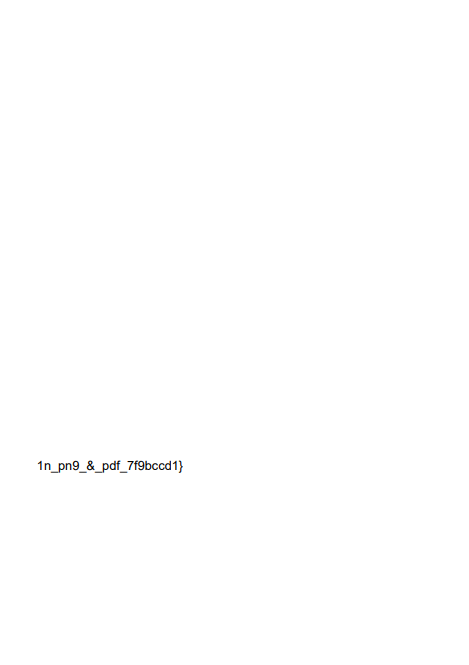
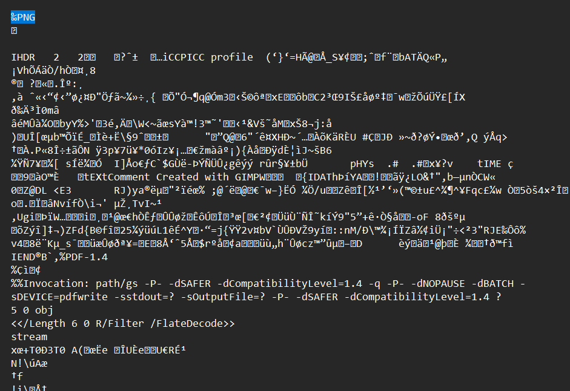
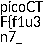

# Forensics

## Scan Surprise

### Challenge
I've gotten bored of handing out flags as text. Wouldn't it be cool if they were an image instead?  
You can download the challenge files here:  
[challenge.zip](https://artifacts.picoctf.net/c_atlas/16/challenge.zip)  
The same files are accessible via SSH here:  
`ssh -p 61159 ctf-player@atlas.picoctf.net`  
Using the password `6abf4a82`. Accept the fingerprint with `yes`, and `ls` once connected to begin. Remember, in a shell, passwords are hidden!  

### Solving
Downloading the given zip file and traversing down the directories we find an image labelled `flag.png` (located at **home/ctf-player/drop-in/**). The image is a QR code, as seen below.  

<br><br><br>

Alternatively, using the `ssh` method to connect to the given server, on logging in also given us the same QR code.  

<br><br><br>

Scanning this QR code (using any phone's camera or a website like https://qrcodescan.in/) shows that it holds some text, which is none other than the flag `picoCTF{p33k_@_b00_7843f77c}`.  
Flag Obtained!

### Flag
> picoCTF{p33k_@_b00_7843f77c}

## Secret of the Polyglot

### Challenge
The Network Operations Center (NOC) of your local institution picked up a suspicious file, they're getting conflicting information on what type of file it is. They've brought you in as an external expert to examine the file. Can you extract all the information from this strange file?  
Download the suspicious file [here](https://artifacts.picoctf.net/c_titan/9/flag2of2-final.pdf).

### Solving
The file provided is a pdf document. On opening it up as it is (with a pdf viewer), we see we've already found half of the flag:

<br><br><br>

To proceed forward, I started by looking into the pdf's raw content by opening it with a text editor (which could've also been done in the terminal using `cat`). On searching through it for the other part of the flag, I found nothing. But something I did find was that the first line of the data contained a PNG file header.

<br><br><br>

So, we know that there is a PNG file within the pdf doc.  
We could've also learnt this by using `binwalk`, which gave:
```
DECIMAL       HEXADECIMAL     DESCRIPTION
--------------------------------------------------------------------------------
0             0x0             PNG image, 50 x 50, 8-bit/color RGBA, non-interlaced
914           0x392           PDF document, version: "1.4"
1149          0x47D           Zlib compressed data, default compression
```
Or using `exiftool`, which gave:
```
ExifTool Version Number         : 12.76
File Name                       : flag2of2-final.pdf
Directory                       : .
File Size                       : 3.4 kB
File Modification Date/Time     : 2025:04:03 20:09:10+00:00
File Access Date/Time           : 2025:04:04 08:18:54+00:00
File Inode Change Date/Time     : 2025:04:03 20:09:22+00:00
File Permissions                : -rwxrwxrwx
File Type                       : PNG
File Type Extension             : png
MIME Type                       : image/png
Image Width                     : 50
Image Height                    : 50
Bit Depth                       : 8
Color Type                      : RGB with Alpha
Compression                     : Deflate/Inflate
Filter                          : Adaptive
Interlace                       : Noninterlaced
Profile Name                    : ICC profile
Profile CMM Type                : Little CMS
Profile Version                 : 4.3.0
Profile Class                   : Display Device Profile
Color Space Data                : RGB
Profile Connection Space        : XYZ
...
```
Even just checking the file type with `file` shows:
```
flag2of2-final.pdf: PNG image data, 50 x 50, 8-bit/color RGBA, non-interlaced
```

To extract it, I first tried using `binwalk -e` with the file, but that just gave an unrecognizable file and a Zlib archive, tinkering with which which didn't prove any use.  
Instead, changing the extension of the file (using `cp` or `mv`) to PNG let me easily open it using the system's default image viewer.  
And on doing that we find the rest of the flag.

<br>

Flag Obtained!

### Flag
> picoCTF{f1u3n7_1n_pn9_&_pdf_7f9bccd1}