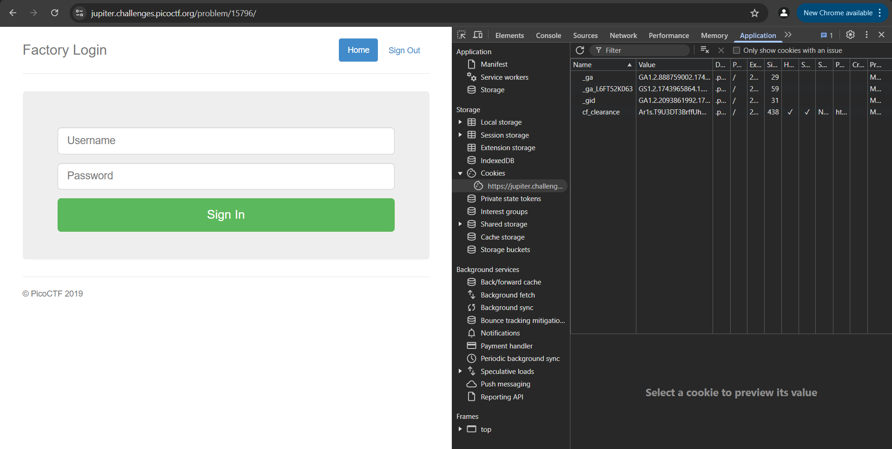
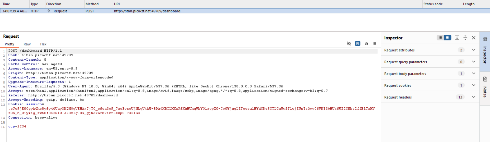
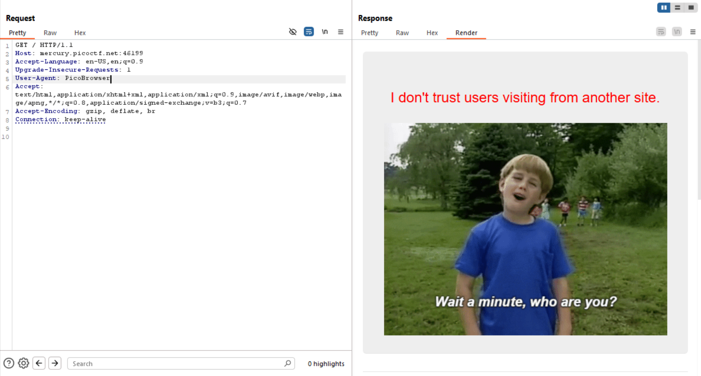

# Web Exploitation

## Cookies

### Challenge
Who doesn't love cookies? Try to figure out the best one. http://mercury.picoctf.net:29649/

### Solving
Following the given link, we land on the following page:

<br><br><br>

In the input field, on entering the suggested value 'snickerdoodle', we're taken to a different page which shows:

<br><br><br>

Now, as the challenge suggests the use of cookies, we can look if any are in use under the *Application* tab of the Developer Tools (**Ctrl+Shift+I** if using Windows).  
Sure enough, we find one labelled `name` with a value currently set to `0`.

<br><br><br>

Keeping the *Application* tab open, we go back to the landing page (using the *Home* button in the top-left), and this time try a random entry.  
I tried 'mango' which was obviously an invalid one (as pointed out by the red text box that appears), and along with that the value of the cookie `name` also changes, now becoming `-1`.

<br><br><br>

I tried another random entry, this time 'shortbread' (I googled types of cookies), and it actually worked! It also changed the cookie's value, which was now `4`.

<br><br><br>

As the green text box says this 'is not very special', we can deduce that there would be a specific entry which hopefully gives us what we want (i.e. the flag).  
Now rather than continuing to enter different entries in the input field hoping to find something, what would be faster and easier is to manually change the value of the cookie itself.  
So I changed it to `10` and refreshed the page, which gave the following:

<br><br><br>

Next I tried making it `30`, but it must've been invalid because it redirected me back to what we got on an invalid entry and changed the cookie's value back to `-1`.

<br><br><br>

So, we can reason that the possible values for the cookie must be numerically below `30`.  

Continuing to try different values like this, it is when we enter `18` that we finally strike gold.  
(Yes, it is possible to write out a script to automate this process, but considering there were not a lot of values to go through, the extra time spent wasn't too much of a waste.)

<br><br><br>
Flag Obtained!

### Flag
> picoCTF{3v3ry1_l0v3s_c00k135_a1f5bdb7}

## GET aHEAD

### Challenge
Find the flag being held on this server to get ahead of the competition http://mercury.picoctf.net:47967/

### Solving
Following the link provided, we land on a page that looks like this:

<br><br><br>

The page contains 2 buttons we can interact with 'Choose Red' and 'Choose Blue'.  
'Choose Red' takes us to [http://mercury.picoctf.net:47967/index.php?](http://mercury.picoctf.net:47967/index.php?), without changing anything visibly about the page, and 'Choose Blue' takes us to http://mercury.picoctf.net:47967/index.php where the background of the page is changed to blue, like so:

<br><br><br>

Here I thought about seeing what the buttons were actually doing by looking into the page source (**Ctrl+U** for Windows):

<br><br><br>

So the 'Choose Red' button on submitting sends a `GET` request to `index.php`, and the 'Choose Blue' button sends a `POST` request to `index.php`.  
From the name of the challenge it makes sense that these requests are what we have to mess around with. And what better application to do that than BurpSuite?  

So I intercepted the page's requests using BurpSuite as I loaded it in the browser, and this is what it showed:

<br><br><br>

None of the attributes or headers (there were 7 of them) seemed like they might point to the flag.  
So I moved on and tried analyzing the requests the page made on clicking the buttons, first the 'Choose Blue' one.

<br><br><br>

The number of request headers increased to 12, and, as we'd just seen, it also made a `POST` request to `index.php`.  

In the headers, there were a few like 'Content-Length' and 'Content-Type' that seemed like they might be useful, but modifying their values didn't do anything different on checking the response to the request. It was the same on using the 'Choose Red' button (in which all that was different was that it made a `GET` request instead, as expected).  

So, it became clear that the headers weren't as relevant as the attribute requests being made (one of the hints also was that we had more than 2 choices, meaning we had to find the third which would reasonably be linked to first two themselves i.e. the forms).  

At this point I turned to the Wonderful World Wide Web to see what other possible types of requests are possible apart from `GET` and `POST`, and learnt that there are also:
* `PUT` - replaces all current representations of the target resource with the request content
* `DELETE` - deletes the specified resource
* `CONNECT` - establishes a tunnel to the server identified by the target resource
* `HEAD` - asks for a response identical to a GET request, but without a response body
* `OPTIONS` - describes the communication options for the target resource
* `TRACE` - performs a message loop-back test along the path to the target resource
* `PATCH` - applies partial modifications to a resource  

(Source was of course [mdn web docs](https://developer.mozilla.org/en-US/docs/Web/HTTP/Reference/Methods))

So I sent the page's traffic to BurpSuite's Repeater and tried replacing the request method in `GET /index.php? HTTP/1.1` with all of the other methods one-by-one.  

The first few didn't do anything of note, apart from changing the `background-color` value to '?',

<br><br><br>

But when I changed the method to `HEAD`, did it actually do something. It gave us the flag.

<br><br><br>

(In hindsight I should've figured out 'HEAD' would be the right method since the name of the challenge is 'GET a**HEAD**'; so that's a lesson learnt)  

Flag Obtained!

### Flag
> picoCTF{r3j3ct_th3_du4l1ty_cca66bd3}

## logon

### Challenge
The factory is hiding things from all of its users. Can you login as Joe and find what they've been looking at?  
https<!-- -->://jupiter.challenges.picoctf.org/problem/15796/ [(link)](https://jupiter.challenges.picoctf.org/problem/15796/) or http://jupiter.challenges.picoctf.org:15796

### Solving
The webpage given to us looks like this:

<br><br><br>

As we've been told to login as Joe, I put that as the username with a random password and got this:

<br><br><br>

Then, I tried putting something else as the username (with, again, a random password), and this time it gave something different:

<br><br><br>

This proved that atleast we're on the right track and getting somewhere.  
Now, just for the sake of it, I tried inputting 'Joe' as the username without any password to see if it was a required field or not, but all it did was give us the same thing as the first time:

<br><br><br>

This didn't really tell us anything.  
However, using trying another username also without any password suprisingly did work and logged us in to the same page:

<br><br><br>

So now we know the password isn't a required field. (Note- neither is the username, which I tested later)  
The logical next step was to take a look behind the scenes.
So coming back to the home page, I opened up DevTools and navigated to the Application tab to start by looking into the cookies. And these were the ones it showed:

<br><br><br>

Neither of these seemed relevant, so then I tried to log in as 'Joe' again. But this didn't change anything, no changes in any values and no additional cookies either:

<br><br><br>

Next I tried logging in with a random username. And this time we got a few more cookies being set:

<br><br><br>

The 'password' and 'username' ones obviously contained whatever we'd inputted in the fields before, but the 'admin' one looked like something that could be useful. It was set to 'False', so naturally, I changed it to 'True' and refreshed the page. Doing so finally gave us exactly what we were looking for:

<br><br><br>

Flag Obtained!

### Flag
>picoCTF{th3_c0nsp1r4cy_l1v3s_6edb3f5f}

## dont-use-client-side

### Challenge
Can you break into this super secure portal?  
https<!-- -->://jupiter.challenges.picoctf.org/problem/37821/ [(link)](https://jupiter.challenges.picoctf.org/problem/37821/) or http://jupiter.challenges.picoctf.org:37821


### Solving
The link takes us to the following page:

<br><br><br>

As there is only one element visible for us to interact with, the credentials input field, that's what I start with. On inserting a random entry in the given credentials field, it triggers an alert box:

<br><br><br>

As the name of the challenge suggests, we should be looking deeper than the surface. So, I opened up the source code for the page (through DevTools):

<br><br><br>

On expanding the script used, we see that there's a single JS function written:
```js

  function verify() {
    checkpass = document.getElementById("pass").value;
    split = 4;
    if (checkpass.substring(0, split) == 'pico') {
      if (checkpass.substring(split*6, split*7) == 'a3c8') {
        if (checkpass.substring(split, split*2) == 'CTF{') {
         if (checkpass.substring(split*4, split*5) == 'ts_p') {
          if (checkpass.substring(split*3, split*4) == 'lien') {
            if (checkpass.substring(split*5, split*6) == 'lz_1') {
              if (checkpass.substring(split*2, split*3) == 'no_c') {
                if (checkpass.substring(split*7, split*8) == '9}') {
                  alert("Password Verified")
                  }
                }
              }
      
            }
          }
        }
      }
    }
    else {
      alert("Incorrect password");
    }
    
  }
```
Its been implemented to verify whether the password entered is correct or not, and its doing so by comparing parts of it with what appear to be strings that make up the flag.  
So I took all these strings and joined them in the order they were being compared in, and it gave us the flag.  
Flag Obtained!

### Flag
> picoCTF{no_clients_plz_1a3c89}

## IntroToBurp

### Challenge
Try [here](http://titan.picoctf.net:49709/) to find the flag

### Solving
The link takes us to the following page:

<br><br><br>

I started by inputting random entries into all the fields, as so:

<br><br><br>

And this takes us to a page asking for 2FA, where I also enter a random value:

<br><br><br>

Which gives us:

<br><br><br>

Now since the name of the challenge is 'IntroToBurp', it only makes sense to open up BurpSuite in order to proceed.  
Using the Proxy to intercept and check out the page's headers and requests, I open it up and again enter a random set of values for the credentials. On clicking 'Register', the website makes a POST request with the following:

<br><br><br>

None of these headers seem like they could be of much use to us (and anyway the last page said 'Invalid OTP' so it makes more sense that that would be what we have to tinker with), so I let the request through and next get a GET request for the dashboard page, which I also let through.  
Now back to the OTP field, I once more enter a random value and hit 'Submit', and this leads to a POST request being made which looks like this:

<br><br><br>

Now since we don't really know what the OTP is supposed to be and so don't know what we can change the value for the header to, I entirely remove the header itself:

<br><br>
(Note: When deleting headers, don't remove the entire line itself, just the text, because it might mess up the request)  <br>

Now forwarding this takes us to the following page:

<br><br><br>

Flag Obtained!

### Flag
> picoCTF{#0TP_Bypvss_SuCc3$S_c94b61ac}

## Who are you?

### Challenge
Let me in. Let me iiiiiiinnnnnnnnnnnnnnnnnnnn  
http://mercury.picoctf.net:46199/

### Solving
The link takes us to the following page:

<br><br><br>

There's nothing obvious given to us to interact with on the page itself. Although we have been told that we must be using the official PicoBrowser to access to site. And since there is no such thing, we must find a workaround for it.  
So I opened up BurpSuite and intercepted the header requests being made:

<br><br><br>

Here, the `User-Agent` header seems to be displaying what browser or app we're using to access the website, so I changed it to 'PicoBrowser':

<br><br><br>

And then I forwarded the request (to the Repeater, so I could preview the website and make any other changes if needed), which gave me:

<br><br><br>

Now none of the pre-existing headers seem to be relevant to what is requested, so I did some sleuthing and found out we could set a header called `Referer`, that tells the original address from which we've arrived (or a resource has been requested), and gave it the address of the challenge page, which is 'http://mercury.picoctf.net:46199/'. This gave me:

<br><br><br>

So I set a `Date` header with the date 'Wed, 01 Aug 2018, 13:00:00 GMT', which next gave me:

<br><br><br>

For this I had to set the `DNT` ('Do Not Track') header to a value of 1 (which basically tells the site that the user prefers not to be tracked), and doing so then gave me:

<br><br><br>

To spoof the country, I had to set the `X-Forwarded-For` header (which specifies the originating IP address of a client) to an IP address belonging to Sweden, and one I found online was '103.50.29.0'. This next gave me:

<br><br><br>

To change the preferred language I made an `Accept-Language` header and gave it 'sv-SE,sv;q=0.9,en;q=0.8', setting our natural language to be Swedish as used in Sweden (refered to by 'sv-SE', followed by 'sv', which is Swedish in general, with a slightly lower preference indicated by 'q=0.9', and then 'en', which is English, with an even lower preference). This finally gave me:

<br><br><br>

Flag Obtained!

To sum up, all the headers with their required values were:
```
User-Agent: PicoBrowser
Referer: http://mercury.picoctf.net:46199/
Date: Wed, 01 Aug 2018, 13:00:00 GMT
DNT: 1
X-Forwarded-For: 103.50.29.0
Accept-Language: sv-SE,sv;q=0.9,en;q=0.8
```
(Note: For finding and checking about different headers, a good resource is https://developer.mozilla.org/en-US/docs/Web/HTTP/Reference/Headers)

### Flag
> picoCTF{http_h34d3rs_v3ry_c0Ol_much_w0w_8d5d8d77}

## where are the robots

### Challenge
Can you find the robots?  
https<!-- -->://jupiter.challenges.picoctf.org/problem/36474/ [(link)](https://jupiter.challenges.picoctf.org/problem/36474/) or http://jupiter.challenges.picoctf.org:36474

### Solving
The link takes us to the following page:

<br><br><br>

The text pretty clearly seems to be refering to the `robots.txt` file for this website (which, FYI, tells search engine crawlers which URLs the crawler can access on that site).  
So, I append '/robots.txt' to the link, taking us to:

<br><br><br>

This tells us that absolutely all web crawlers are disallowed from accessing the page located at `/477ce.html`.  
So, naturally, thats where we must go next:

<br><br><br>

Flag Obtained!

### Flag
> picoCTF{ca1cu1at1ng_Mach1n3s_477ce}

## More SQLi

### Challenge
Can you find the flag on this website.  
Try to find the flag [here](http://saturn.picoctf.net:50181/).

### Solving
