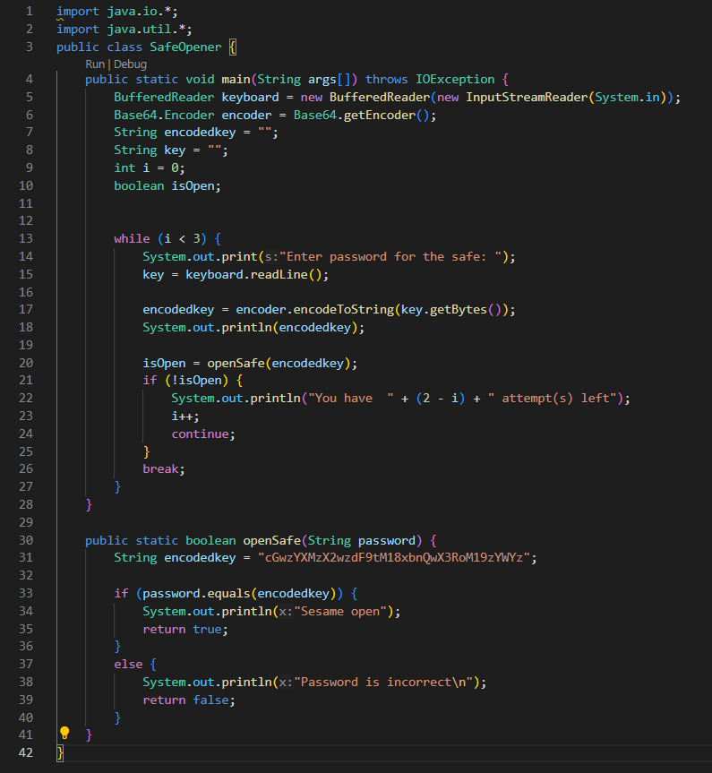
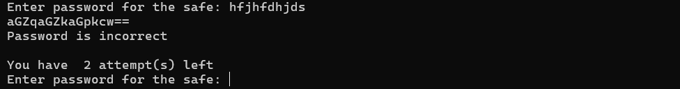
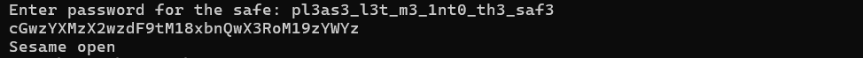

# Reverse Engineering

## file-run1

### Challenge
A program has been provided to you, what happens if you try to run it on the command line?  
Download the program [here](https://artifacts.picoctf.net/c/218/run).

### Solving
The program provided is a file titled `run` with no extension specified. So to find what type of file it was, I used the `file` command in the terminal, which gave this:  
```
run: ELF 64-bit LSB pie executable, x86-64, version 1 (SYSV), dynamically linked, interpreter /lib64/ld-linux-x86-64.so.2, BuildID[sha1]=6e8c618e35e1676dcfc1528b849d349e82f127f1, for GNU/Linux 3.2.0, not stripped
```
So we know that the file is an executable. Running it using `./run` displays:
```
The flag is: picoCTF{U51N6_Y0Ur_F1r57_F113_9bc52b6b}
```
Flag Obtained!

### Flag
> picoCTF{U51N6_Y0Ur_F1r57_F113_9bc52b6b}

## file-run2

### Challenge
Another program, but this time, it seems to want some input. What happens if you try to run it on the command line with input "Hello!"?  
Download the program [here](https://artifacts.picoctf.net/c/156/run).

### Solving
Just like in '**file-run1**', we've been given a `run` file, which on running `file` on gives something similar as well:
```
run: ELF 64-bit LSB pie executable, x86-64, version 1 (SYSV), dynamically linked, interpreter /lib64/ld-linux-x86-64.so.2, BuildID[sha1]=303d7c50cf258e07aa508de37a50e4d85d5e475f, for GNU/Linux 3.2.0, not stripped
```
But this time directly running the file with `./run` doesn't give us the flag; instead it shows:
```
Run this file with only one argument.
```
And as given in the problem statement, we need to run it with input "Hello!". Considering this, we modify the command to `./run "Hello!"` ("Hello!" is the argument provided here as input), and this now displays:
```
The flag is: picoCTF{F1r57_4rgum3n7_96f2195f}
```
Flag Obtained!  

(P.S.- Opening the file using a text editor such as Notepad we would've found the flag in plain sight, and while this is definitely not the correct way to solve the challenge, it does help in a pinch.)

### Flag
> picoCTF{F1r57_4rgum3n7_96f2195f}    

## Safe Opener

### Challenge
Can you open this safe?  
I forgot the key to my safe but this [program](https://artifacts.picoctf.net/c/83/SafeOpener.java) is supposed to help me with retrieving the lost key. Can you help me unlock my safe?  
Put the password you recover into the picoCTF flag format like:  
`picoCTF{password}`  

### Solving
The given java program looks like this:

<br><br><br>

On running it we're asked to enter a password, which we currently don't know.

<br><br><br>

So to find the password, we should start by analyzing the code of the program.  
In main(), we can see that lines `5-10` are for declaring all the variables used, `13-28` for taking the password from the user and checking whether its correct or not (using a custom function), and `30-42` for the function `openSafe()` used for comparing the password entered by the user with the correct one.  

Looking at line `31`, there is a string which can easily be recognized as the correct password.
```java
String encodedkey = "cGwzYXMzX2wzdF9tM18xbnQwX3RoM19zYWYz";
```
The only catch is thats it's been encoded, as, before comparing the user's input using the function `openSafe()`, that's being encoded as well:

<br><br><br>

(Breaking-down what's happening here)  
First, `key.getBytes()` is converting `key` (the user's input) into a byte array.  
Then, `encoder.encodeToString()` (where `encoder` is an instance of the `Base64.Encoder` class) *encodes the specified byte array into a String using the Base64 encoding scheme* (as given in the [documentation](https://docs.oracle.com/javase/8/docs/api/java/util/Base64.Encoder.html#:~:text=all%20input%20bytes.-,encodeToString,specified%20byte%20array%20into%20a%20String%20using%20the%20Base64%20encoding%20scheme.,-This%20method%20first)).  

So it's these steps that we have to reverse to get the password. For this, we'll have to write our own Java program.  

Along with having an `Encoder` nested class, the `Base64` class also has a `Decoder` class ([Source](https://docs.oracle.com/javase/8/docs/api/java/util/Base64.html)), which we start by making an instance of:
```java
Base64.Decoder decoder = Base64.getDecoder();
```
And to reverse the `encodeToString()` method, there exists a method for the `Base64.Decoder` class `decode()`, which *decodes all bytes from the input byte array using the Base64 encoding scheme* (also from the [documentation](https://docs.oracle.com/javase/8/docs/api/java/util/Base64.Decoder.html#:~:text=Method%20Detail-,decode,returned%20byte%20array%20is%20of%20the%20length%20of%20the%20resulting%20bytes.,-Parameters%3A)). So, we pass the flag with this method, assigning the returned value to a byte array.
```java
byte[] decodedkey = decoder.decode("cGwzYXMzX2wzdF9tM18xbnQwX3RoM19zYWYz");
```
Now all that's left is converting it back to a string, which can be done by constructing a new `String` object in the following manner:
```java
String decodedString = new String(decodedkey);
```
And then we just print the string to display the flag.  

So, the program we finally have is:
```java
Base64.Decoder decoder = Base64.getDecoder();
byte[] decodedkey = decoder.decode("cGwzYXMzX2wzdF9tM18xbnQwX3RoM19zYWYz");
String decodedString = new String(decodedkey);
System.out.println(decodedString);
```
And on running it, the output we get is:

<br>

Which seems correct, and we can confirm this by entering it into the original program.

<br>

Flag Obtained!

### Flag
> picoCTF{pl3as3_l3t_m3_1nt0_th3_saf3}