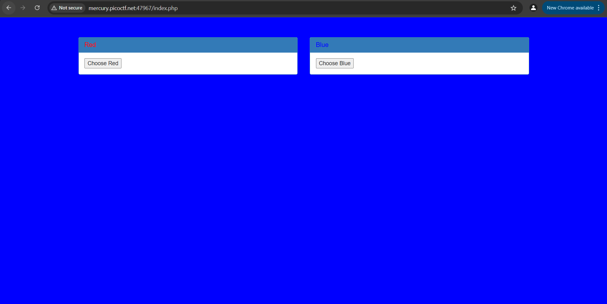

# Web Exploitation

## Cookies

### Challenge
Who doesn't love cookies? Try to figure out the best one. http://mercury.picoctf.net:29649/

### Solving
Following the given link, we land on the following page:

   

In the input field, on entering the suggested value 'snickerdoodle', we're taken to a different page which shows:

   

Now, as the challenge suggests the use of cookies, we can look if any are in use under the *Application* tab of the Developer Tools (**Ctrl+Shift+I** if using Windows).  
Sure enough, we find one labelled `name` with a value currently set to `0`.

   

Keeping the *Application* tab open, we go back to the landing page (using the *Home* button in the top-left), and this time try a random entry.  
I tried 'mango' which was obviously an invalid one (as pointed out by the red text box that appears), and along with that the value of the cookie `name` also changes, now becoming `-1`.

   

I tried another random entry, this time 'shortbread' (I googled types of cookies), and it actually worked! It also changed the cookie's value, which was now `4`.

   

As the green text box says this 'is not very special', we can deduce that there would be a specific entry which hopefully gives us what we want (i.e. the flag).  
Now rather than continuing to enter different entries in the input field hoping to find something, what would be faster and easier is to manually change the value of the cookie itself.  
So I changed it to `10` and refreshed the page, which gave the following:

   

Next I tried making it `30`, but it must've been invalid because it redirected me back to what we got on an invalid entry and changed the cookie's value back to `-1`.

   

So, we can reason that the possible values for the cookie must be numerically below `30`.  

Continuing to try different values like this, it is when we enter `18` that we finally strike gold.  
(Yes, it is possible to write out a script to automate this process, but considering there were not a lot of values to go through, the extra time spent wasn't too much of a waste.)

   
Flag Obtained!

### Flag
> picoCTF{3v3ry1_l0v3s_c00k135_a1f5bdb7}

## GET aHEAD

### Challenge
Find the flag being held on this server to get ahead of the competition http://mercury.picoctf.net:47967/

### Solving
Following the link provided, we land on a page that looks like this:

   

The page contains 2 buttons we can interact with 'Choose Red' and 'Choose Blue'.  
'Choose Red' takes us to [http://mercury.picoctf.net:47967/index.php?](http://mercury.picoctf.net:47967/index.php?), without changing anything visibly about the page, and 'Choose Blue' takes us to http://mercury.picoctf.net:47967/index.php where the background of the page is changed to blue, like so:

   

Here I thought about seeing what the buttons were actually doing by looking into the page source (**Ctrl+U** for Windows):

   

So the 'Choose Red' button on submitting sends a `GET` request to `index.php`, and the 'Choose Blue' button sends a `POST` request to `index.php`.  
From the name of the challenge it makes sense that these requests are what we have to mess around with. And what better application to do that than BurpSuite?  

So I intercepted the page's requests using BurpSuite as I loaded it in the browser, and this is what it showed:

   

None of the attributes or headers (there were 7 of them) seemed like they might point to the flag.  
So I moved on and tried analyzing the requests the page made on clicking the buttons, first the 'Choose Blue' one.

   

The number of request headers increased to 12, and, as we'd just seen, it also made a `POST` request to `index.php`.  

In the headers, there were a few like 'Content-Length' and 'Content-Type' that seemed like they might be useful, but modifying their values didn't do anything different on checking the response to the request. It was the same on using the 'Choose Red' button (in which all that was different was that it made a `GET` request instead, as expected).  

So, it became clear that the headers weren't as relevant as the attribute requests being made (one of the hints also was that we had more than 2 choices, meaning we had to find the third which would reasonably be linked to first two themselves i.e. the forms).  

At this point I turned to the Wonderful World Wide Web to see what other possible types of requests are possible apart from `GET` and `POST`, and learnt that there are also:
* `PUT` - replaces all current representations of the target resource with the request content
* `DELETE` - deletes the specified resource
* `CONNECT` - establishes a tunnel to the server identified by the target resource
* `HEAD` - asks for a response identical to a GET request, but without a response body
* `OPTIONS` - describes the communication options for the target resource
* `TRACE` - performs a message loop-back test along the path to the target resource
* `PATCH` - applies partial modifications to a resource  

(Source was of course [mdn web docs](https://developer.mozilla.org/en-US/docs/Web/HTTP/Reference/Methods))

So I sent the page's traffic to BurpSuite's Repeater and tried replacing the request method in `GET /index.php? HTTP/1.1` with all of the other methods one-by-one.  

The first few didn't do anything of note, apart from changing the `background-color` value to '?',

   

But when I changed the method to `HEAD`, did it actually do something. It gave us the flag.

   

(In hindsight I should've figured out 'HEAD' would be the right method since the name of the challenge is 'GET a**HEAD**'; so that's that lesson learnt)  

Flag Obtained!

### Flag
> picoCTF{r3j3ct_th3_du4l1ty_cca66bd3}